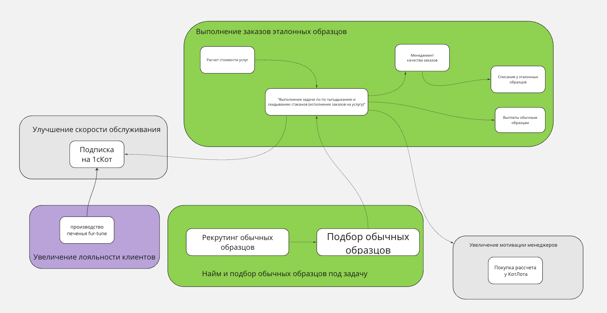
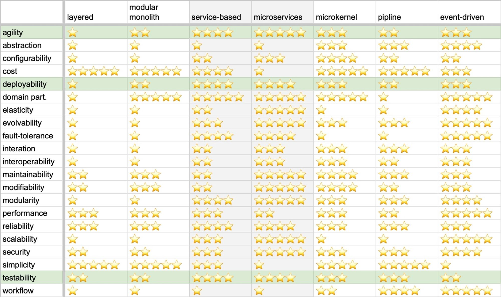

# ADR-001: Выбор архитектурного стиля для Make cats free

Status: Proposed - ждет окончания курса

## Context

Основываясь на требованиях и консёрнах стейкхолдеров, было определено, что  необходимо реализовать систему из пяти боундед-контекстов, каждый из которых имеет свой набор характеристик.

Каждая из характеристик была найдена по своим причинам:

- scalability, modifiability, maintainability, testability, agility и evolvability для всего, потому что система растёт;
- agility, testability и deployability для всей системы. Взяты из требования к выкатке функционала за два недельных спринта, который связан с TTM;
- consistency для данных в боундед-контекстах «расчёта и выплаты зарплаты тестировщикам», «мэтчинга игрушек и клиентов» и «инвентаризации и склада».

Для сервиса заявок характерно elasticity т.к. возможена DDos-атака.

## Decision: смешанный стиль Service-based и микросервисный

Для системы были выбраны три основные характеристики: agility, deployability и testability. По общей таблице со стилями видно, что есть ровно два варианта, которые подойдут: service-based или микросервисы.

Для сервиса заявок характерно решил сделать отдельную БД, она будет в формате микросервиса,
остальная часть будет в формате service-based.

## Сompliance
Так как нет вариантов автоматической проверки реализации архитектурного стиля, то вся проверка будет делаться вручную посредством изучения проектной документации, кода и автоматически генерируемой карты сервисов, основанной на инструментах трассировки.