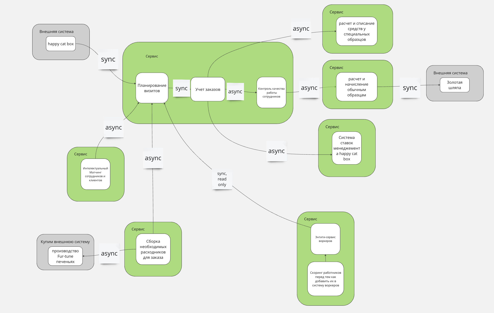
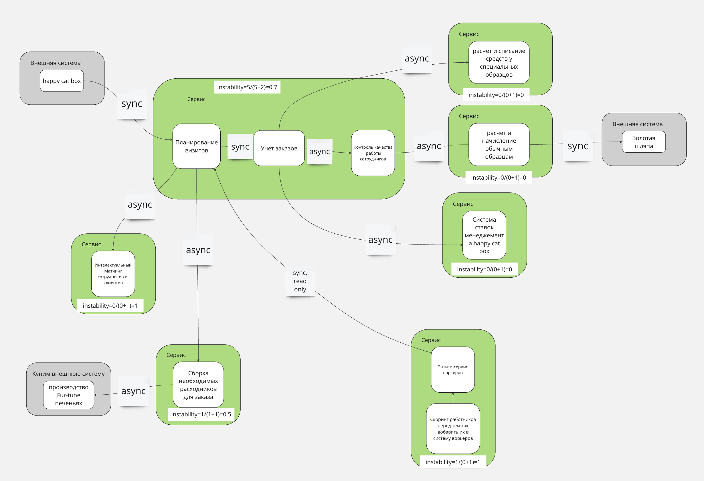

# Домашка четвертого урока

## TODO

В этом уроке нам необходимо исправить систему, которую сделали до нас. Т. е. надо из «начальной системы» получить то, что у вас получилось в конце третьей домашки. Для того чтобы было интереснее, в качестве «начальной системы» я предлагаю выбрать один из двух вариантов:

- система, которую вы получили после нулевой домашки;
- если системы после нулевой домашки нет — взять реализацию системы из первого урока. Если система из первого урока соответствует тому, что получилось в конце третьего, — взять структуру системы, нарисованную ниже.

Задачи по домашке:

- для каждого сервиса который добавится или удалится и связанных с ним сервисов посчитайте значение instability;

- опишите, какие сервисы и боундед-контексты в каком месте и каким образом будут меняться;

- спланируйте, как и в какой последовательности будет происходить работа. 

Сделайте два описания, для каждого из условий:

когда свободных людей и ресурсов нет, а опыт и (или) инфраструктура есть
когда есть свободные люди и ресурсы, а опыта и (или) инфраструктуры нет


## Домашка нулевого урока


### Было


В первой домашке у меня получился кейс "берем Кафку и фигачим". В принципе такой подход бы даже сработал в 90% случаев, но после 4х недель марафона стало ясно, что так не всегда ок. Прямо распиливать тут не получится, скорее привести к какому-то похожему виду из уроков.

В схеме не было стэкхолдеров, сервисы разделены "ну наверно как-то так". Ну и в общем я отталкивался больше от технической части, т.к. она просто мне ближе и понятнее.

## Че делать-то?

Вот тут вообще нифига не понятно=)

Решил пойти в режиме троечниками и взять пример из ДЗ и что-то делать похожее.



Примерные шаги:

1. Выкинуть службу уведомлений, как отдельный сервис ибо логика нотификаций не может быть отдельным сервисом.
2. Описать стэкхолдеров и еще раз описать стэкхолдеров.
3. Посмотреть на систему и начать больно описывать события из требований на основе ES или чего-то похожего.
4. Прикинуть модели в системе.

5. БиллинговыйСервис будет распилен на 2 сервиса:
   1. выплаты обычным образцам и списания у специальных образцов будут частью выполнения заказов
   2. выплаты сотрудникам склада будут входить относиться к учету и выдаче расходников

6. Прикинуть коммуникации - почти все будут асинхронными, кроме нескольких.

## для каждого сервиса который добавится или удалится и связанных с ним сервисов посчитайте значение instability

Вот тут я вообще ни фига не понял.



Я честно запутался по стрелочкам, вроде все написано, но я ни


## спланируйте, как и в какой последовательности будет происходить работа

### 1. Есть свободные люди и ресурсы, а опыта и (или) инфраструктуры нет

```Мы советуем сделать контринтуитивную штуку и вместо выноса какой-либо части сделать новую функциональность, на которой обкатать инфраструктуру. Наверняка у бизнеса есть горящие запросы, и среди них есть те, которые можно быстро реализовать вне «монолита».```

Будем распиливать и добавлять новую функциональность в биллинговые сервисы, возьмем например выплаты обычным образцам - их не жалко.

#### 2. Когда свободных людей и ресурса нет, а опыт и (или) готовая инфраструктура есть

```Если у компании есть готовая инфраструктура или команда с опытом, а ресурсов нет, значит, нужно начинать с того, что принесёт максимальный эффект при минимальных усилиях. Обычно начинают с core-поддоменов, которые не удовлетворяют характеристикам в рамках монолита. Потому что это самые важные элементы системы и приносят много денег. Логично начинать с улучшения важного.```

Тут стоит выбрать места, где может что-то посыпаться, типа сервиса найма, т.к. он общедоступен.
Дальше будет смотреть, где Кафка не тянет.
